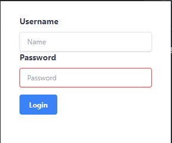

## Omniplex Learning Chrome Extension Test

Build a simple chrome extension app. The app should have:
- Login page with username and password
- The password should be "password"
- The details of the user must be stored in some local store in the browser
- Once logged in successfully, the user should be displayed with a welcome message
- After 5 sec of inactivity user should be presented with an alert
- Pressing yes opens a new tab to a url
- Pressing no closes the alert
- Logging out clears user data from local storage

[Fahed Arshad](mailto:arshad.fahed@gmail.com)

### [Click here to see the Video Review](https://www.loom.com/share/4d48e3425a794029b2106d35c6870b5c)

## Proposed Solution

- Scaffolded the app with a simple html page and js script injected
- Created a simple UI for login page
- Stored user details in local storage
- Welcome message added
- Logout button configured
- Inactivity functions developed
- Custom modal component created

## Screenshots

## Assumptions

- no authentication is needed at the moments
- no need for a global state management solution

## Libraries / Tools Used

- Typescript
- TailwindCSS
- Jest
- Chrome extension API
- LocalstorageAPI

## Setup

To install the dependencies run:

`npm install`

Then add to chrome://extensions by pointing to directory where app is saved

## Future Work

1. Complete test coverage to achieve 90%
2. Improve styling and responsive design
3. Test for perfomance
4. Add user authentication